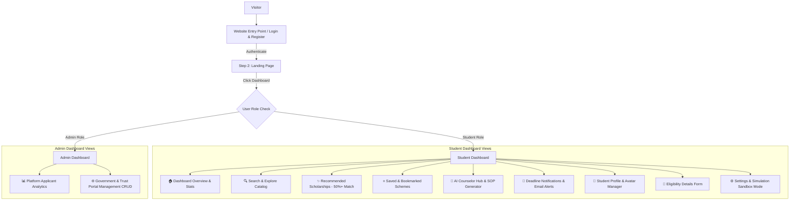

# 🎓 ScholarHub — Platform Overview & System Summary

**ScholarHub** is a full-stack, AI-powered academic scholarship and financial aid matching platform designed to empower students across India. It connects students—ranging from Class 10th and 12th school board graduates to Undergraduate (B.Tech, B.Sc, MBBS), Postgraduate (M.Tech, M.Sc, MD), and Doctorate (PhD, MPhil) scholars—with official government schemes, state quota benefits, corporate CSR grants, and merit fellowships tailored to their unique academic, financial, and category profiles.

---

## 🚀 Key Features & Capabilities

### 1. 🔍 Multi-Portal Scheme Catalog & Search Engine
- **Integrated Government & Corporate Portals**:
  - **🏛️ MahaDBT Portal** (`mahadbt.maharashtra.gov.in`): Rajarshi Chhatrapati Shahu Maharaj EBC Fee Reimbursement (₹60,000/yr), Dr. Punjabrao Deshmukh Hostel Allowance (₹30,000/yr), Post-Matric OBC/VJNT/SBC & SC/ST Schemes, Class 10th/12th Board Merit Grants.
  - **🏛️ MahaJYOTI Portal** (`mahajyoti.org.in`): MPhil & PhD Research Fellowships (₹31,000/mo), Foreign Overseas Higher Education Grants (₹20 Lakhs/yr), Free Coaching & Tab Allowances for MHT-CET/JEE/NEET, Civil Services (UPSC/MPSC) Coaching.
  - **🏢 Vidyasaarathi Portal** (`vidyasaarathi.co.in`): ACC Engineering Grant, JSW Udaan Degree Grant, TransUnion CIBIL Women in STEM, Nuvoco Shiksha Bharat Grant, Post-10th & 12th Merit Grants.
  - **🏛️ National Scholarship Portal (NSP)**: Central Sector Scheme of Top Class Education (CSSS), National Means-cum-Merit School Grants (NMMSS).
- **Multi-Criterion Filter Toolbar**:
  - **Class / Graduation Level**: Class 10th/12th, Undergraduate, Postgraduate, Doctorate.
  - **Discipline / Stream**: Engineering & Tech, Medical & Healthcare, STEM, Arts & Commerce.
  - **Funding Provider**: Official Government Schemes vs. Private Corporate CSR Grants.
  - **Instant Portal Pills**: Filter instantly by selecting source portals.
  - **Interactive Search Bar & % Match Threshold**: Prominent search bar with percentage match badges (e.g., `✨ 95% Match`) and a 50%+ threshold filter for recommended grants.

---

### 2. 🤖 Google Gemini AI Counselor & SOP Generator
- **Resilient Multi-Model Fallback Pipeline**: Automatically fails over across Google Gemini models (`gemini-3.6-flash`, `gemini-3.5-flash-lite`, `gemini-3.5-flash`, `gemini-3.7-flash`) for maximum availability.
- **Context-Aware AI Chat Hub**: Incorporates live student profile context (Course, Grade Marks %, Family Income, Caste Category, Domicile State) directly into AI prompts to answer eligibility queries, explain application guidelines, and compare schemes.
- **Statement of Purpose (SOP) Generator**: Assists students in writing tailored essays and application motivation letters for scholarship submissions.

---

### 3. 📧 Automated Deadline Email Alerts & Gmail SMTP Integration
- **Direct Gmail SMTP Delivery**: Integrated using Node.js `nodemailer` (`scholarhub34@gmail.com`).
- **1-Click Email Reminder**: Students can click **"Email Deadline Reminder"** inside any scholarship details modal to receive an instant reminder in their inbox.
- **Branded HTML Email Templates**: Sends responsive HTML email notifications featuring grant title, countdown days remaining (e.g., `⏳ 3 Days Left`), grant amount, and direct application links.
- **Account Settings Email Tester**: Built-in test trigger in the Settings tab to test live email delivery.

---

### 4. 🧪 Dual Working Modes (Real-Time vs. Simulation Sandbox)
- **⚡ Real-Time Live Mode**: Live PostgreSQL database synchronization, active Google Gemini AI endpoints, live Gmail SMTP email notifications, and direct official portal redirects.
- **🧪 Simulation Sandbox Mode**: Fast offline testing simulator, mock AI responses, and interactive sandbox triggers:
  - ⏳ *Simulate Urgent Deadline* (Shifts deadline 5 days closer)
  - ✨ *Simulate New Grant Match* (Injects a high-match grant notification)
  - 🛡️ *Simulate Instant Verification* (Marks profile credentials 100% verified)
- **Pulsating Status Beacon**: Visual indicators (`🟢 Real-Time Active` vs `🧪 Simulation Mode Active`) persisted across user sessions.

---

### 5. 👤 Student Profile & Avatar Management
- **Custom Profile Avatar Upload**: 1-click file picker supporting PNG, JPG, JPEG, and WEBP image formats.
- **Client-Side Image Compression**: Automatically resizes and compresses avatar images to 256x256 base64 format for rapid loading.
- **Live Avatar Sync**: Instant synchronization across the Profile Overview hero card, Topbar header avatar, and local session storage.
- **Comprehensive Eligibility Profile**: Manages student full name, phone number, qualification level, course, grade percentage, annual family income, category (General/OBC/SC/ST/VJNT/SBC/EWS), and domicile state.

---

### 6. 🛠️ Admin Management Portal
- **Dashboard Analytics**: Tracks Total Applicants, Active Schemes, Pending Approvals, and Total Applications.
- **Scholarship Portal CRUD Management**:
  - Add, edit, enable/disable, and delete external scholarship portals (MahaDBT, MahaJYOTI, Vidyasaarathi, NSP).
  - Track total linked scholarship schemes per portal.
  - Safe deletion checks preventing accidental removal of active portals.

---

### 7. 🔐 Authentication & Security System
- **Complete Auth Flow**: User Registration, Login, OTP Email Verification, Forgot Password, and Reset Password procedures.
- **JWT Session Tokens**: Secure token-based authentication stored in local storage and passed via Bearer headers.
- **Role-Based Access Control**: Distinguishes between `Student` and `Admin` users with protected routing (`ProtectedRoute`).
- **Interactive Auth UI**: Animated character elements providing password visibility toggles, live feedback, and seamless error handling.

---

## 🛠️ Technology Stack

| Layer | Technology / Libraries |
| :--- | :--- |
| **Frontend** | React 18 · Vite · React Router DOM · Tailwind CSS · Lucide React · Context API · HTML5 Canvas Particle Engine |
| **Backend** | Node.js · Express.js · PostgreSQL (`pg`) · JWT (`jsonwebtoken`) · Nodemailer (Gmail SMTP) · Bcrypt.js |
| **AI Integration** | Google Gemini REST API (`generativelanguage.googleapis.com`) + Multi-Model Fallback Engine |
| **Database** | PostgreSQL (`scholarhub` database) |

---

## 📁 Repository & Codebase Structure

```text
ScholarHub/
├── app/                        # Next.js / Static global layouts & styles
├── backend/                    # Node.js & Express API Server
│   ├── src/
│   │   ├── config/             # PostgreSQL database connection (db.js)
│   │   ├── controllers/        # Auth, Admin, Profile, Scholarship, Notification logic
│   │   ├── middleware/         # JWT authentication & role-verification middleware
│   │   ├── routes/             # Express API routes (auth, profile, scholarship, ai, admin)
│   │   ├── services/           # Gemini AI service, Email service, OTP service
│   │   └── tests/              # Security and auth test suites
│   ├── index.js                # Express app initialization & server entry point
│   └── package.json
├── frontend/                   # React + Vite Single Page Application
│   ├── src/
│   │   ├── components/         # Auth & Dashboard UI components
│   │   │   ├── auth/           # LoginForm, RegisterForm, OTP, Forgot/Reset Password
│   │   │   └── dashboard/      # Topbar, Sidebar, StatCards, SearchScholarshipView,
│   │   │                       # AiAssistantHub, NotificationsSection, SettingsSection,
│   │   │                       # StudentProfileOverview, UserProfileSection, Admin Dashboard
│   │   ├── context/            # AuthContext & ThemeContext (Dark/Light mode)
│   │   ├── hooks/              # Custom React hooks (useAuth)
│   │   ├── lib/                # Eligibility engine, mock dataset, utils
│   │   ├── pages/              # LandingPage, AuthPage, StudentDashboard, AdminDashboard
│   │   ├── App.jsx             # React Router route definitions & protected routes
│   │   └── main.jsx            # React root mount point
│   └── package.json
├── PROGRESS.md                 # Development changelog & achievement milestones
├── README.md                   # Quick start & environment configuration guide
├── SECURITY.md                 # Security audit documentation
└── WEBSITE_SUMMARY.md          # Comprehensive summary document (this file)
```

---

## 📜 Complete API Endpoint Reference

### 1. **Authentication Routes** (`/api/auth`)
- `POST /api/auth/register` — Register a new student or admin account
- `POST /api/auth/login` — Authenticate user and issue JWT token
- `POST /api/auth/send-otp` — Generate and email OTP verification code
- `POST /api/auth/verify-otp` — Verify OTP code for account activation
- `POST /api/auth/forgot-password` — Initiate password recovery email
- `POST /api/auth/reset-password` — Reset account password using reset token

### 2. **Student Profile Routes** (`/api/profile`)
- `GET /api/profile` — Fetch current student's full eligibility profile
- `POST /api/profile` — Create or update student eligibility details (marks, income, category, domicile)
- `POST /api/profile/avatar` — Upload and update profile avatar image

### 3. **Scholarship Routes** (`/api/scholarships`)
- `GET /api/scholarships` — Fetch list of available scholarships and filter by portal/degree
- `POST /api/scholarships/apply` — Submit a scholarship application to PostgreSQL
- `POST /api/scholarships/bookmark` — Save or unsave a scholarship to bookmarks
- `GET /api/scholarships/saved` — Retrieve bookmarked scholarships for current user

### 4. **AI Assistant Routes** (`/api/ai`)
- `POST /api/ai/chat` — Ask Gemini AI Assistant questions using current profile context
- `POST /api/ai/essay` — Generate a Statement of Purpose (SOP) or motivation essay

### 5. **Notification & Email Routes** (`/api/notifications`)
- `GET /api/notifications` — Retrieve student notifications and deadline alerts
- `POST /api/notifications/send-deadline-alert` — Trigger Gmail SMTP deadline alert email

### 6. **Admin Management Routes** (`/api/admin`)
- `GET /api/admin/stats` — Retrieve overall admin metrics (applicants, schemes, applications)
- `GET /api/admin/portals` — List all external scholarship portals
- `POST /api/admin/portals` — Create a new scholarship portal
- `PUT /api/admin/portals/:id` — Update existing portal details
- `PATCH /api/admin/portals/:id/status` — Toggle portal active/disabled status
- `DELETE /api/admin/portals/:id` — Delete a scholarship portal

---

## 🗺️ Application Navigation Flow



---

## 🎯 Summary

**ScholarHub** bridges the gap between students and financial support by transforming scholarship searching from an overwhelming manual process into a smart, automated, AI-assisted experience. With real-time database persistence, interactive sandbox testing, automated deadline notifications, and government portal integrations, ScholarHub ensures students never miss a financial aid opportunity.
